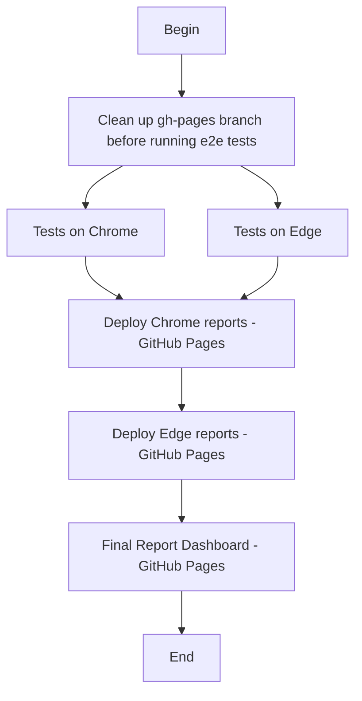

# Project to demonstrate knowledge in Cypress + Design Patterns + CI/CD (Github Actions and Pages) + Mochawesome Reports + Multiple Browsers

Sample project to experiment with [Cypress](https://cypress.io) to test the ServeRest app along with CI/CD using GitHub Actions and Pages.

[](https://github.com/clark-ewerton/cypress-serverest-cicd/actions/workflows/cicd.yml)
[](https://clark-ewerton.github.io/cypress-serverest-cicd/)


## Table of Contents

- [Pre-requirements](#pre-requirements)
- [Installation](#installation)
- [Project Structure](#project-structure)
- [Implemented Patterns](#implemented-patterns)
- [Tests](#tests)
- [User Flow test](#user-flow-test)
- [Headless mode](#headless-mode)
- [Interactive mode](#interactive-mode)
- [CI/CD Pipeline](#cicd-pipeline)
- [Multi-Browser](#multi-browser)
- [Test Artifacts](#test-artifacts)
- [Test Reports](#test-reports)
- [Contributing](#contributing)
- [License](#license)

## Pre-requirements

You need to have [Node.js](https://nodejs.org/) and npm installed on your computer.

For this project, the following versions were used:

```sh
$ node -v
v20.16.0

$ npm -v
10.9.0
```

## Installation

Clone the repository and install the dependencies:

```sh
git clone https://github.com/clark-ewerton/cypress-serverest-challenge.git
cd cypress-serverest-challenge
npm install
```

## Project Structure

```
cypress/
├── e2e/
│   ├── api/
│   │   └── authentication/
│   │       └── loginAPI.cy.js
│   └── gui/
│       └── authentication/
│           └── loginGUI.cy.js
├── fixtures/
├── support/
│   ├── commands
|   |      └── addContext.js
|   |      └── api_commands.js
|   |      └── gui_commands.js
│   └── e2e.js
├── factories/
│   └── userFactory.js
├── services/
│   └── userService.js
cypress.config.js
generate-index.js
.gitHub/
├── workflows/
│   └── cicd.yml
public/
└── videos/
```
- Support: Utilities like custom commands and common hooks
- Fixture: Mocked data for testing (contract testing)
- E2E: Test specifications
- factories: Data factory layer for dynamic test data creation using Faker
- services: Service layer to abstract API calls
- context.js: Context configuration for reporting (attach videos to reports)
- public/videos: Folder where test videos are copied for publishing on GitHub Pages
- generate-index.js: it's gonna generate an index.thml file into gh-pages to consolidate all the reports per browser

## Implemented Patterns

✅ Data Factory Pattern — Generates dynamic data for tests

✅ Service Layer Pattern — Abstraction for API requests (For API)

✅ Custom Commands — Simplifies and reuses test actions (For GUI)

✅ Test Context Attachment — Attaches videos and artifacts to reports

✅ GitHub Pages — Publishes test artifacts and videos for public access

## Tests

> By default, the tests will run against [`https://front.serverest.dev`], but if you need to run them in a different URL (e.g.: `http://localhost:3000/`), change the `baseUrl` property in the [`cypress.config.js`](./cypress.config.js) file.
>
> For API, the tests will run against [`https://serverest.dev`].

### User Flow test

For this challenge, I covered three scenarios for the login feature in both API and GUI:

- ✅ Validate User Signup and Log in successfully
- ❌ Validate login throws an error with invalid credentials
- ❌ Validate login throws an error with invalid email format

### Headless mode

Run all tests in headless mode:

```sh
npm test
```

### Interactive mode

1. Run `npm run cy:open` to open the Cypress App;
2. Select **E2E Testing**;
3. Select one of the available browsers (e.g., Electron), and click **Start**;
4. Run the following test files manually:
   - [`cypress/e2e/gui/authentication/loginGUI.cy.js`](./cypress/e2e/gui/authentication/loginGUI.cy.js)
   - [`cypress/e2e/api/authentication/loginAPI.cy.js`](./cypress/e2e/api/authentication/loginAPI.cy.js)
5. Wait for the tests to finish!

## CI/CD Pipeline

This project uses **GitHub Actions** to run tests automatically on every push or pull request. The whole code can be found here: `cypress/workflows/cypress.yml`

In this project CI is responsible for compile, build and run e2e automated test.

CD is responsible to upload the reports and video files on GitHub Pages.

Videos and screenshots (in case of failures) are uploaded as artifacts in the pipeline.

See below the flow that the pipeline is doing:



## Multi-Browser

WorkFlow is prepared to run e2e test on multiple browsers such as:
- Google Chrome (latest)
- Microsoft Edge (latest)

*Implementing via GitHub Actions Matrix:*
```yaml
strategy:
  matrix:
    browser: [chrome, edge]
```

## Test Artifacts

- 🎥 **Videos:** `cypress/videos/` (copied to `public/chrome/videos/` or `public/edge/videos/` for GitHub Pages)
- 🖼️ **Screenshots:** `cypress/screenshots/` (only on failure)

Note: Artifacts are generated during pipeline execution and may not exist locally until tests are run.

## Test Reports

This project uses Mochawesome reporter for test reporting. After test execution:

- Individual JSON reports are generated for each test spec

- Reports are merged into a single file

- A comprehensive HTML report is generated

Reports are available in `cypress/reports/mochawesome/` and are uploaded as artifacts in the CI/CD pipeline.

Test artifacts (videos and reports) are automatically published via GitHub Pages.

After workflow deploys reports into gh-pages branch, it's gonna have this type of structure:

```
└── /
├── index.html # Report Dashboard
├── chrome/ # Complete Report (Chrome)
│ ├── videos/ # Test video records
│ └── report.html # Mochawesome Report
└── edge/ # Complete Report (Edge)
├── videos/
└── report.html
```

Access automatically generated test reports and artifacts:

[](https://clark-ewerton.github.io/cypress-serverest-cicd/)

## Contributing

Contributions are welcome!  
If you find a bug or have a feature request, feel free to open an issue or submit a pull request.

## License

This project is licensed under the MIT License.
